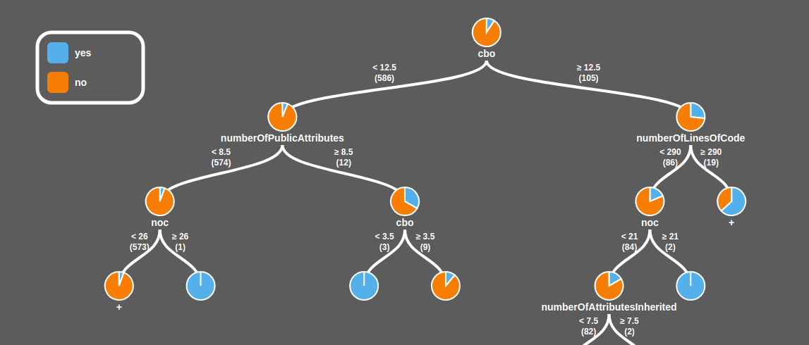

## Pie Tree

This is an incomplete project of a visualization tool of [Decision Trees](https://en.wikipedia.org/wiki/Decision_tree "Decision Tree - Wikipedia") using [d3](https://d3js.org/ "d3's Homepage"). The highest point of this tool is that the Tree has a Pie Chart in every node. This was thought to facilitate the visualization of nodes where classification is cleary positive, negative or unclear. The tree receives a json file (in code, it is hardcoded) and shows expandable nodes containing the percentage of yes/no classification. As the nodes are expanded, classification becomes closer to 100%.

The project was abandoned in 2016 and since I am a totally beginner in d3 (and had spent more time than I should making this "demo"), I stopped working on it. If someone wants to finish this job, I would be very happy to help. Please, contact me.

A demo page can be found [here](https://paulobruno.github.io/PieTree/ClassificationTree).

